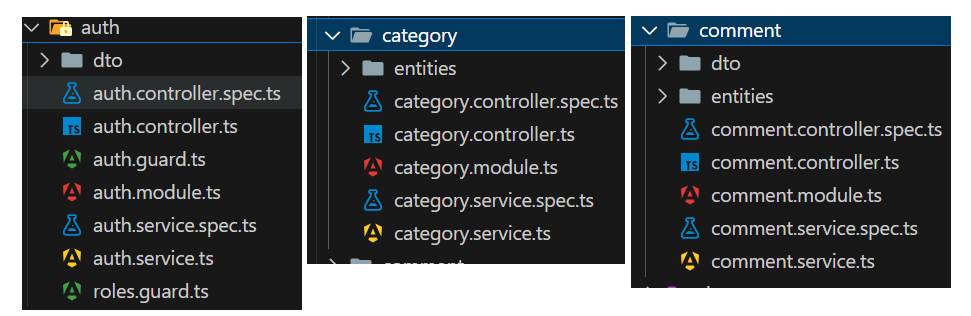

# Project Title: Build a Blog website similar to Viblo

### Purpose of the project
The purpose of a web blog project similar to Viblo is to create a platform where users can share knowledge, insights, and experiences related to technology, programming, and software development, fostering a community of learning and collaboration among tech enthusiasts.

## What to prepare
Install mySQL, nestjs, reactjs,XAMP...

### Technology and tools used
- Technology and Tools Used
- Programming Software: Visual Studio Code
- Web Server: XAMPP
- Source Code Management: GitHub
- Tool for Designing Object-Oriented Design and Analysis Diagrams: diagrams.net
- Front-End Development:
-  + Languages: HTML, CSS, JavaScript
-  + Frameworks: React.js, SCSS
- Back-End Development:
-  + Language: JavaScript
-  + Framework: NestJS
- Database Design Software: MySQL
- Authentication and Authorization: JWT
## Usecase diagram

## Databases

## test Api by Postman

## DataBase XMAP

## How to run
After cloning the project and opening the solution file, you will see the project folder structure like this:

- BackEnd-FrontEnd

- BackEnd

- FrondEnd

## ALGORITHM ANALYSIS
-

## Features
### Login function
- Admin/User enters login name and password, the system will check the database and then respond to admin/user.
- If there is no account with the corresponding login name and password, the system will report an error of incorrect login name or password
#### Admin Functions
- User Registration and Login:

Manage user accounts, including registration and authentication.
Approve or reject user registrations.
Reset passwords for users.
- Write Article:

Create and publish articles.
Edit or delete any article.
- View Articles:

View all published articles.
Monitor article statistics and metrics.

#### Client Functions
- User Registration and Login:

Register a new account.
Log in to an existing account.
- Write Article:

Create and publish their own articles.
Edit or delete their own articles.
- View Articles:

Browse and read all published articles.
Search for specific articles by keywords or categories.
- Comment on Articles:

Post comments on articles.
Edit or delete their own comments.
- Follow Users:

Follow other users to receive updates on their new articles.
Unfollow users as desired.
- Vote Up/Vote Down Articles:

Vote up or vote down articles.
View the voting score for articles.
## Program interface
- Testing various scenarios such as system login, data entry/view, search and statistics functions, and query/report functions.
- Evaluation of the system's performance and user feedback.

# Kịch bản 1 - Sign in

# Kich bản 2 - User interface
## Client Interface:

## Admin Interface:

# Kịch bản 3 -Detailed Functions
## For Client:
- View article

- Function to display my posts:

-Chức năng viết bài:

- Update post function:

- Delete post function:

- Profile update function:

- Comment function: 

- Follow function:

- Function to vote up/ down articles:

## For Admin
- Add User function:

- List Users function:

- Delete User function:

 
- Add Post function:

- List Post function:

- Profile function:

